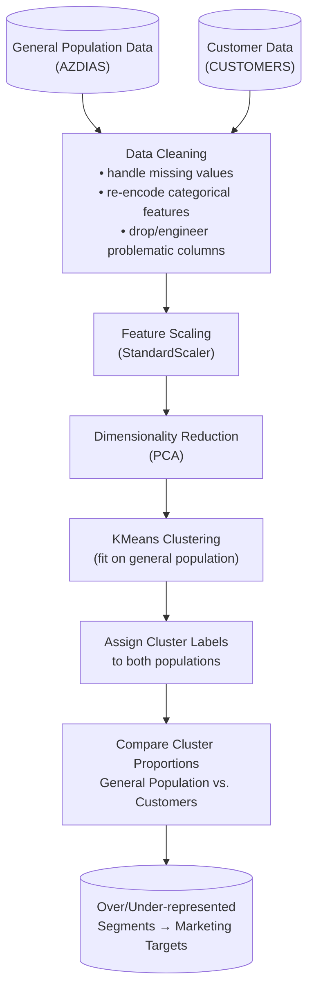

# Identify Customer Segments — Mail-Order Company Customer Segmentation

Unsupervised learning project that identifies the demographic segments of the German population most likely to become customers of a mail-order sales company, using dimensionality reduction and clustering.

> **Note:** This project was completed as part of a Udacity Data Science coursework assignment (used to fulfill a WGU course requirement), built on demographic data provided by Arvato/Bertelsmann via Udacity.

---

## Business Problem

Mail-order marketing is expensive per contact, and blasting offers to the general population wastes budget on people unlikely to ever become customers. The company at the center of this project needed to answer: **which segments of the general population look demographically similar to our existing customers — and which segments don't?**

Rather than predicting who will buy from labeled outcomes, this is an **unsupervised segmentation problem**: the demographic structure of the general population is compared against the demographic structure of existing customers. Segments that are *overrepresented* among customers relative to the general population are the company's best targets for acquisition marketing; segments that are *underrepresented* are a poor use of marketing spend.

**Why it matters:** even a modest improvement in who gets targeted translates directly into lower cost-per-acquisition and higher campaign ROI — a far more efficient strategy than uniform, untargeted outreach.

---

## Dataset

This project uses demographic data provided by **Arvato Financial Services / Bertelsmann**, distributed through Udacity's Data Scientist Nanodegree program:

- **`Udacity_AZDIAS_Subset.csv`** — demographic data for a sample of the general German population
- A corresponding customer demographics file (used to compare segment proportions against the general population)
- Each row represents a person, with a large number of demographic, household, and regional attributes (hundreds of columns covering things like age, financial typology, household composition, and neighborhood characteristics)

**Obtaining the data:** this dataset is provided under Udacity/Arvato's data use agreement and is **not redistributed in this repository**. It is only accessible to enrolled Udacity Data Scientist Nanodegree students (or those granted access by Arvato/Bertelsmann) via the Udacity classroom. If you're trying to reproduce this project, you'll need access to that course to download the original files.

---

## Technologies Used

- **Python 3.11+**
- **pandas / numpy** — data loading, cleaning, and manipulation
- **scikit-learn** —
  - `sklearn.preprocessing` (scaling/encoding features ahead of PCA)
  - `sklearn.decomposition` (PCA for dimensionality reduction)
  - `sklearn.cluster` (KMeans clustering)
- **matplotlib / seaborn** — visualizations (explained variance, cluster proportions)
- **Jupyter Notebook** — development environment (`Identify_Customer_Segments.ipynb`)

---

## Architecture



**Pipeline summary:**
1. **Clean** both the general population and customer datasets — handling missing/unknown values (many features use sentinel codes for "unknown"), dropping or re-encoding categorical and mixed-type features, and aligning columns between the two datasets.
2. **Scale** all features so that PCA and KMeans aren't dominated by features with larger numeric ranges.
3. **Reduce dimensionality with PCA**, since the raw demographic data has a very high number of correlated features; a smaller set of principal components captures most of the variance while making clustering more tractable.
4. **Cluster with KMeans**, fit on the general population's reduced feature space.
5. **Compare** the proportion of each cluster in the general population vs. the customer base — clusters where customers are overrepresented relative to the general population are the company's core targets.

---

## Setup and Execution

### Prerequisites
- Python 3.11+
- Jupyter Notebook or JupyterLab
- Access to the Udacity/Arvato demographic dataset (see [Dataset](#dataset) above)

### Installation

```bash
pip install pandas numpy matplotlib seaborn scikit-learn jupyter
```

### Running the analysis

1. Place `Udacity_AZDIAS_Subset.csv` (and the customer demographics file) in the project directory.
2. Launch Jupyter:
   ```bash
   jupyter notebook
   ```
3. Open `Identify_Customer_Segments.ipynb` and run all cells in order. The notebook will:
   - Clean and preprocess both datasets
   - Scale features and apply PCA
   - Determine an appropriate number of clusters and fit KMeans
   - Compare cluster distributions between the general population and customers
   - Visualize which segments are over- or under-represented among customers

A pre-rendered version of the analysis (with all outputs and plots) is also included as `Identify_Customer_Segments.html` for viewing without running the notebook.

---

## Sample Outputs

The notebook produces several visualizations central to the analysis:
- **Cluster size comparison chart** — bar chart comparing what % of the general population falls into each cluster vs. what % of customers fall into each cluster


  
- **Feature Weights** — shows how a princicle componante is made up of different attributes (the attributes are in German)


- **Customer Features at an Overrepresented Cluster** - shows how the different features in cluster 6 ( also shown in notebook is cluster 5) and how they are represented in the cluster


---

## Key Findings and Lessons Learned

- **Unsupervised segmentation can substitute for labeled targeting data.** Without ever having a "will this person buy" label, comparing population structure to customer structure via clustering still produces an actionable targeting signal.
- **Data cleaning is the majority of the work in real-world demographic data.** Sentinel/placeholder codes for missing values, mixed-type columns, and inconsistent encodings across the general population and customer files required careful, deliberate handling before any modeling could begin — a recurring theme in real business datasets versus clean textbook ones.
- **Dimensionality reduction made clustering interpretable.** With hundreds of raw demographic features, clustering directly would be both computationally heavy and hard to interpret. PCA compressed the feature space while preserving the signal needed to separate meaningfully different demographic profiles.
- **The most useful output wasn't a single "best segment" — it was a ranked comparison.** Marketing decisions benefit from seeing *relative* over/under-representation across all segments, not just identifying one winner, since budget allocation is rarely all-or-nothing.

---

## Possible Extensions

- Profile each over-represented cluster by its dominant original (pre-PCA) features, to turn "Cluster 3" into a plain-language customer persona for marketing teams
- Test sensitivity of the segmentation to the number of clusters chosen (elbow method / silhouette score)
- Build a simple scoring function that maps a new prospect's demographic profile to a "likelihood of being a high-value segment" score
- Pair this segmentation with response data from an actual past campaign to validate that the identified segments do in fact convert better
